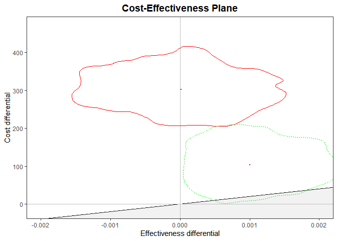

VANTDET
================
Nathan Green
2020-05-27

An R package for a cost-effectiveness analysis using decision tree
models of novel active TB diagnostics.

The tests investigated are:

  - transcriptomics
  - proteomic SELDI
  - proteomic flowassay
  - molecular
  - IGRA

The pathways are:

  - rule-in
  - rule-out
  - dual-test

## Installing `VANTDET`

To install the development version from github:

``` r
# library(devtools)
install_github("n8thangreen/VANTDET")
```

## Example: Rule-out tests

``` r
library(VANTDET)
library(BCEA)
library(ggplot2)
library(purrr)
library(dplyr)
library(formattable)
library(IDEAdectree)
# library(ceplot)
```

Load the package data.

``` r
data("TBdata_clinical_cleaned", package = "IDEAdectree")

data("drug", package = "VANTDET")
data("QALYloss",  package = "VANTDET")
data("costs", package = "VANTDET")
data("time_res", package = "VANTDET")
data("performance", package = "VANTDET")
```

Initialise variables.

``` r
dat <- list()

QUANT <- 0.5  #0.65
yearindays <- 365.25
WTP <- c(20000, 30000)/yearindays
```

### Run model

We pass the structure of the tree to `dectree()` as a function argument.

``` r
terminal_cost_ruleout <- function(cost) {

  c(cost$visit1 + cost$std.TB + cost$newtest,
    cost$visit1 + cost$std.TB + cost$newtest + cost$visit2,
    cost$visit1 + cost$std.nonTB + cost$newtest,
    cost$visit1 + cost$newtest)
}

terminal_health_ruleout <- function(health) {

  c(health$std.TB + health$newtest,
    health$std.TB + health$newtest + health$followup,
    health$std.nonTB + health$newtest,
    health$newtest)
}
```

The run the model and rearrange the output so we can plot.

``` r
dat <- list()

dat[['transcript']] <-
  dectree(
    data = data,
    name.newtest = "transcript",
    costDistns = costs,
    performance = list(performance$transcript_ruleout),
    time_res = list(time_res$transcript),
    drug = drug,
    QALYloss = QALYloss,
    terminal_cost = terminal_cost_ruleout,
    terminal_health = terminal_health_ruleout)

dat[['IGRA']] <-
  dectree(
    data = data,
    name.newtest = "IGRA",
    costDistns = costs,
    performance = list(performance$IGRA),
    time_res = list(time_res$IGRA),
    drug = drug,
    QALYloss = QALYloss,
    terminal_cost = terminal_cost_ruleout,
    terminal_health = terminal_health_ruleout)


e_df <- do.call(cbind, purrr::map(dat, 'e'))
c_df <- do.call(cbind, purrr::map(dat, 'c'))

evens <- seq(from = 2, to = 2*length(dat), 2)
odds <- evens - 1

QALYgain <- as.matrix(data.frame(0, e_df[ ,odds] - e_df[ ,evens]))
cost_incur <- as.matrix(data.frame(0, c_df[ ,evens] - c_df[ ,odds]))

res_bcea <- bcea(e = -QALYgain,
                 c = -cost_incur,
                 interventions = c("status-quo", names(dat)))
```

### Output plots

``` r
ceplot::my_contour2(
  res_bcea,
  graph = "ggplot2", CONTOUR_PC = '5%') +
  coord_cartesian(xlim = c(-0.002, 0.002)) +
  theme(legend.position = "none")
```

<!-- -->
